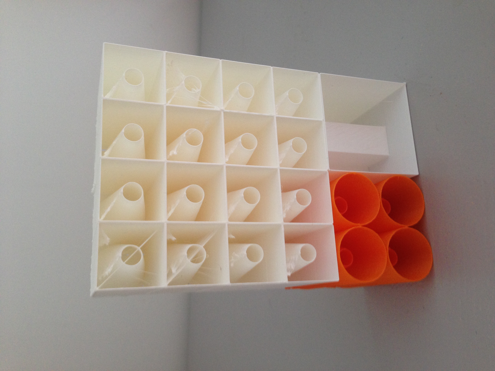
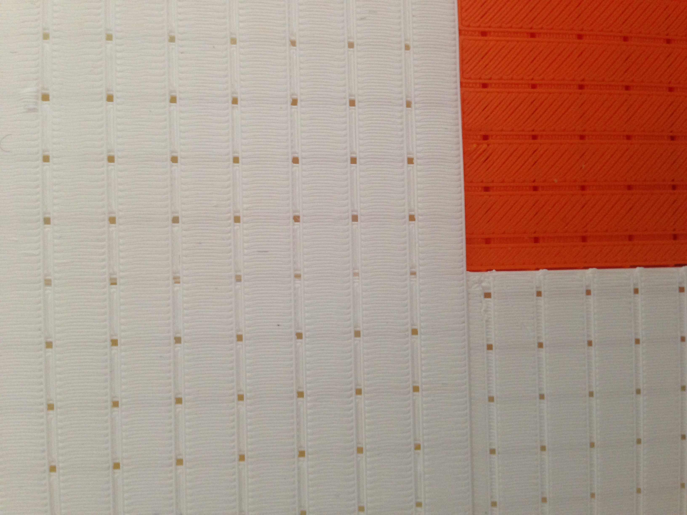
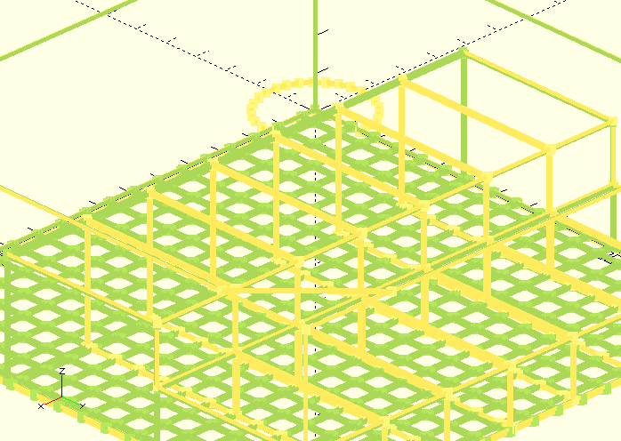
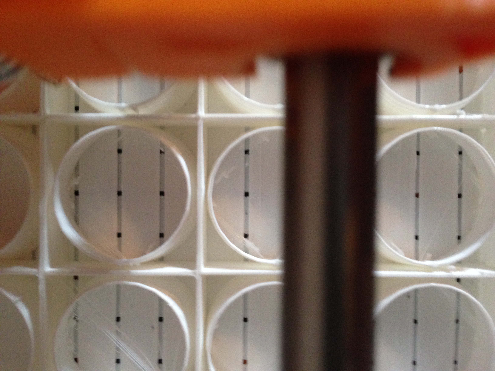
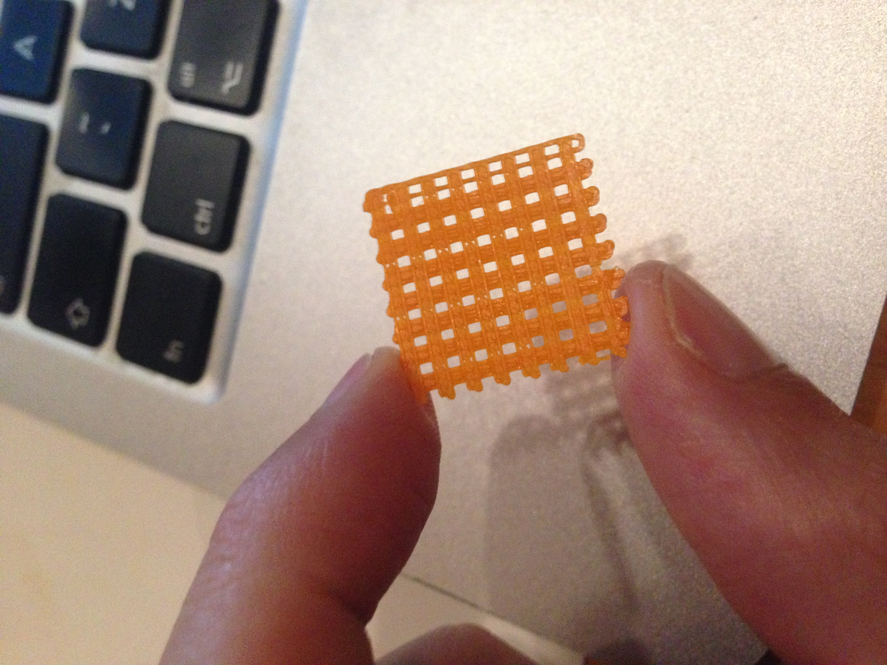

# 3D Printable Noise Absorbers 

Noise absorbing structures targeted at Fused Deposition Modeling, low-cost, low definition 3D printers — the ones you can buy for $300 up to $2000. Based on acoustic research litterature from 1975 up to 2016.

Use them to reduce noise at home, reflected by walls, a balcony ceiling, in an office, a studio, a noisy meeting room…

*View from the back of a 150x100x60mm panel composed of 3 differents modules: cones with straight walls, cones with cylinder walls, segmented back. The open back is placed against a wall or ceiling that creates the fourth side. Printed on a 300€ 3D printer*

*Front of the composited panel with 0.8mm square holes*

## Why 3D print noise absorbers?

### The problem
Managing noise is a constant issue in homes, offices and commercial spaces.

Available materials like foams or wood panels mixed filled with absorber materials are bulky and heavy.
They also have fixed, non customizable bandwidth absorption peaks. Mixing and matching different materials to broaden the absorption band is impractical. These materials also can't be produced on-site, or can't be produced in very small, customized series.

Thus several acoustic researchers in recent years have tested how 3D printed structures could allow light, customizable noise absorber panels, tuned to select frequencies.

Let's 3D print them out of the lab ;-) 

3D print noise-absorbing panels on your low-cost 3D Printer, customized to your acoustic needs — and then affix them to walls or ceilings to correct the acoustic of your space.

### The goal

This *3D Printable Noise Absorbers* project goal is to make advanced noise absorbing panels printable on the new wave of low-cost 3D printers. It works by creating FLOSS generative modules that can be used by 3D printers owners, tested by acoustic researchers and enhanced by 3D developpers.

## The modules

They are several modules, using different noise absorption strategies: 

 1. Micro Perforated Panels with cone backing 

 2. Micro Perforated Panels with 3-length tunnel backing

 3. Destructive interference – hard to tune, still quite large **[not implemented]**

 4. Perforated panels with coplanar coiled air chamber – allow low frequency absorption with very thin panels **[preliminary, brittle implementation]**

Each strategy is an independant module that will have its own physical absorption profile and its own advantages and drawbacks to be tested experimentally.

Modules are parametrized, and each strategy can be adjusted, giving a wide range of different modules: **different depth of backing, different porosity, different channel length…**

By combining these modules into larger panels, we could achieve custom absorption profiles and wider band absorption.

You can combine the modules into larger panels directly in OpenSCAD or in the slicer software for direct printing of fully assembled sections. Or you can print each module individually for manual assembly on the targeted surface.

###Design challenge: Printing sub-milimeters holes on a low-cost FDM 3D printer 
 
 When trying to print a surface with sub-milimeters holes using a low-cost FDM 3D printer, most of the time the holes get clogged by the plastic expansion and movement imprecisions. You can use many slicing tricks to try and overcome this, but then it becomes very specific to your slicer software, your printer and even the filament you use.
 
The challenge is to design a part that will consistently print on a wide range of 3D printers without specific slicing settings.
 
Thus, *Two Layers* panels are a dedicated design that can consistently get sub-milimeters holes on low cost FDM printers, by superimposing two perpendicular layers of stripes. Stripes print much more consistently than holes, and by superimposing them at 90º we create square holes of sub-milimeter width.

## To Do

You can help this project by contributing to:

* Turn it into a real OpenScad library

* Test printed modules at home
	* Try and print them at home on your printer
	* Contribute changes to make them easier and cheaper to print
* Test printed modules at work if you work in a lab! :-)
	* Test them in an acoustic lab to profile them and understand their acoustic behavior
	* Use the test data to build acoustic functions that given frequencies as input will return the right parameter values for the module generation (perforation, size, height, etc.)

* Point to research that would be useful for the project

* Build a Destructive Interference module

* Make a better coil module

* Make the segmented module more flexible, with more control on how it scales

## Rough estimation of filament cost

Based on premium PLA, at retail price, back of the napkin estimation of filament cost start around 50€ / $50 for 1㎡ of micro-perfortated panels with segmented 5cm backs. This go up to 100€ / $100 for 1㎡ of 5cm cone-based back.

Use of cheaper filament or bulk purchase would drive the price lower, at around 25€ / $25 for 1㎡ of micro-perfortated panels

(excluding: electricity which is negligeable in many case; maintenance, wear and human time which is *not* negligible :-)

### Further reducing cost

Some strategies to further reduce cost are 

* Create acoustically effective coiled and segmented back with low backing lenght, giving us compact modules and less layers to print
* Source, test and select low cost filaments with the right properties for printing acoustic panels
* Test how reducing material in module affect absorption and give end-users options in term of costs

## Flame retardant filaments

A range of flame retardant filament exist, and they would be needed for use in space governed by strict rules concerning inflammability.
They are usually ABS loaded with non-flammable material. **Not tested yet!**

If you are a producer or seller of Flame Retardant Filament, or if you are a 3D printer owner who prints with these filaments, you can help the project by printing and testing the modules with these filaments.

## References

*These references sould be added in the code and the Readme at the appropriate places. For the moment they are listed as is. You are encouraged to go and read them. Some of this public research is kept behind a publisher paywall, and if you are not a scholar with an institution subscription you might want to ask friends or use the militant science websites that are opening research to all readers. The rest is open access, for all to learn.*

Practical overview of micro perforated panels: [MICROPERFORATED PANEL ABSORBER DESIGN: A TUTORIAL D. W. Herrin, X. Hua, and J. Liu 2014](https://www.researchgate.net/publication/280088717_Microperforated_panel_absorber_design_A_tutorial) 

Paper on Setaki's work on 3D printing customized sound absorbers using destructive interference: [Sound absorption and additive manufacturing, Foteini Setaki, CONFERENCE PAPER · AUGUST 2015 ](https://www.researchgate.net/publication/281005456)

Nicely illustrated report on Setaki's work on 3D printing customized sound absorbers using destructive interference: [ACOUSTICS BY
ADDITIVE MANUFACTURING, Foteini Setaki 2015](http://repository.tudelft.nl/assets/uuid:153e94d2-4b56-4577-b286-f0fd85199234/Report_F_Setaki.pdf)

3D printing and acoustic absorbers: [Implications of solid freeform fabrication on acoustic absorbers. O.B. Godbold, R.C. Soar and R.A. Buswell](http://dx.doi.org/10.1108/13552540710824805)

3D printing and acoustic absorbers: [From MPA to strategically designed absorbers using solid freeform fabrication techniques, Godbold, Oliver Kang, Jian Soar, R.C. Buswell, Richard A. 2007](https://dspace.lboro.ac.uk/2134/10142)

Godbold's doctoral thesis on 3D printing and acoustic absorbers: [Investigating broadband acoustic absorption using rapid manufacturing, Doctoral Thesis, Oliver Godbold 2008](https://dspace.lboro.ac.uk/2134/8058)

Comparing Wirt's backing when combined with micro perfored panels: [Varying Backing Cavity Depths to Achieve Broadband Absorption using Micro-Perforated Panels
CONFERENCE PAPER · AUGUST 2013 X. Hua D. W. Herrin P. Jackson 2013](https://www.researchgate.net/publication/280089574_Varying_Backing_Cavity_Depths_to_Achieve_Broadband_Absorption_using_Micro-Perforated_Panels)

[A PERFORATED PANEL SOUND ABSORBER FOR LOW FREQUENCIES Dengke Li, Daoqing Chang, Bilong Liu, Jing Tian](http://www.iiav.org/archives_icsv_last/2015_icsv22/content/papers/papers/full_paper_918_20150510165741701.pdf)

Mixing Microperforated Panels with segmented backs: [Acoustic properties of micro-perforated panel absorbers backed by Helmholtz resonators for the improvement of low-frequency sound absorption
Soon-Hong Park](http://dx.doi.org/10.1016/j.jsv.2013.04.029)

Comparing Microperforated Panels with 3 different segmented backs and with an empty cavity. Detailled dimensions and results: [Enhancing the Performance of Microperforated Panel Absorbers by Designing Custom Backings Weyun Liu, D.w  W. Herrin 2016](http://pub.dega-akustik.de/IN2016/data/articles/001103.pdf)

In the mid 70's Wirt developed novel ways to increase the tube length of reactive absorbers: [Sound Absorptive Materials to Meet Specials Requirement Wirt 1975](http://scitation.aip.org/content/asa/journal/jasa/57/1/10.1121/1.380423) DOI:10.1121/1.380423

Fascinating review of acoustic cloaking using metamaterials:
[ACT PRE 0914 Valencia-Review on Acoustic Metamaterials](https://www.esa.int/gsp/ACT/doc/EVENTS/acoustic_workshop/ACT-PRE-0914-valencia-review_acoustic_metamaterial.pdf)

[Ultra-thin metamaterial for perfect and omnidirectional sound absorption N. Jiménez, W. Huang, V. Romero-García, V. Pagneux, and J.-P. Groby 2016](https://arxiv.org/abs/1606.07776)

Coiled absorbers: [Acoustic metasurface-based perfect absorber with deep subwavelength thickness Yong Li and Badreddine M. Assouar 2016](https://www.researchgate.net/publication/294109188_Acoustic_metasurface-based_perfect_absorber_with_deep_subwavelength_thickness)

Coiled absorbers tested using 3D printed samples: [Ultrathin low-frequency sound absorbing panels based on coplanar spiral tubes or coplanar Helmholtz resonators Xiaobing Cai, Qiuquan Guo, Gengkai Hu, and Jun Yang 2014](https://www.researchgate.net/publication/266082711_Ultrathin_low-frequency_sound_absorbing_panels_based_on_coplanar_spiral_tubes_or_coplanar_Helmholtz_resonators)

## Settings 

###Micro Perforated Panels 

**perforation\_density\_in_percent = 1**
Total surface covered by the holes. Less than 2% is better according to the litterature: [ref needed]
1 percent is a good default  
Exception: For Coplanar Coiled 3 is a good default.  [ref needed]

**perforation_size = 0.8**  
must be sub-milimeter to be effective. 
    Researchers often finds 0.5mm diameter to be very effective, but a real challenge for Fused Filament Deposition 3D printers, even with the two layers technique.
     0.8 is a good default that should print well using Two Layers setting.   
    Exception: For Coplanar Coiled 4mm seems to be the default in the litterature, as they are not using the sub-milimeter effect. [ref needed] 
    
**perforation_surface = perforation\_size\*perforation_size**  
panel_thickness = 0.8;  must be equal or slightly more than perforation diameter according to the litterature [ref needed]

panel_size = 150;
panel_surface = panel_size*panel_size;

###Back
**back\_depth = 50**  

A good target range is 50 to 80mm
Exception: For Coplanar Coiled 4mm might be sufficient if we believe the latest litterature [ref needed].

###Cone back

**cone\_front\_opening = 25** 

The 25mm value is derived from "plastic horn arrays 144 per square foot" = 12 per 300mm. in [Sound Absorptive Materials to Meet Specials Requirement Wirt 1975](http://scitation.aip.org/content/asa/journal/jasa/57/1/10.1121/1.380423) DOI:10.1121/1.380423

**cone\_ratio = 3**  
**cone\_back\_opening = cone\_front\_opening / cone\_ratio**  
**cone\_plus\_spacing = cone\_front\_opening + 0**    
**cone\_by\_lines = panel\_size / cone\_plus\_spacing**  
**cone\_relative\_length\_in\_percent = 95**  

###Coiled air chamber back

**coil\_total\_width = 20**  
**coil\_conduct\_width = 4**   
**wall = 0.8**
